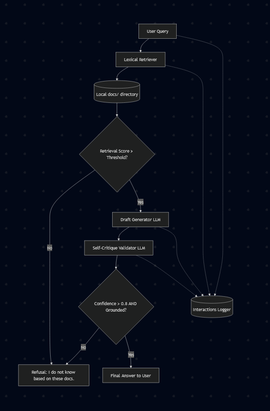

# DocuBot: RAG with Agentic Validation and Grounding Checks

## Original Project Summary

**DocuBot** is a small, Python-first documentation assistant. Its **original** goal was to help developers answer questions about a project by:

- Loading **local Markdown (and plain text) files** from a `docs/` directory
- Building a **hand-rolled lexical index** (token-based inverted index and keyword scoring—not a vector database)
- Supporting three ways to answer: **naive full-corpus LLM**, **retrieval-only** (snippets, no model), and **basic RAG** (retrieve top snippets, then ask the model to answer using only that context)

That design keeps the system transparent: you can see **which text** reached the model and reason about retrieval quality without extra infrastructure.

## Title and Summary

This repository now ships an **upgraded DocuBot** that adds an **agentic validation loop** after draft generation. A **second Gemini call** (the validator) scores how well the draft is supported by the **same retrieved snippets**, returns a **confidence score** between **0.0** and **1.0**, and a **pass/fail** judgment. System guardrails enforce a **minimum confidence** threshold so borderline answers are not shown blindly.

**Why this matters for developer trust:** fluent LLM answers can **sound** authoritative while **misstating** APIs, env vars, or behavior. By validating the draft **against the evidence actually retrieved**, DocuBot can **withhold** a bad answer and fall back to a clear refusal string—reducing silent hallucinations and making it easier to align answers with **checkable** documentation.

## Architecture Overview

<p align="center">
  
</p>

End-to-end RAG in this project follows a **linear pipeline** (you can add a diagram image here later):

1. **Lexical retrieval** — The query is tokenized and scored against indexed chunks; top snippets are chosen with guardrails (e.g., evidence thresholds, one strong chunk per file where applicable). Output: a structured **`RetrievedContext`** (list of filename + snippet pairs).

2. **Draft generation** — **Gemini** produces an initial answer using **only** those snippets (`DraftAnswer`). This is the fastest path to a candidate response but is **not** trusted as final until validated.

3. **Agentic validation** — A **separate** Gemini prompt treats the snippets as ground truth, checks the draft for contradictions and unsupported claims, and returns **`ValidationResult`** (`passed`, `confidence_score`, `reasoning`). Code also enforces **`RAG_VALIDATION_MIN_CONFIDENCE`** (configurable via environment variable).

4. **Final output / fallback** — If validation **passes**, the user sees the draft. If it **fails**, the system may run **one** snippet-conditioned **retry** draft; if validation still fails, the user sees exactly: **`I do not know based on these docs.`** Each run can be audited via append-only JSONL logs under `logs/rag_interactions.jsonl`.

Key modules: `docubot.py` (retrieval), `rag_pipeline.py` (orchestration), `llm_client.py` (draft + validator + retry prompts), `pipeline_models.py` (typed pipeline state), `rag_logger.py` (structured logging).

## Setup Instructions

Follow these steps in order from a terminal in the **project root** (the folder that contains `main.py` and `requirements.txt`).

### 1. Prerequisites

- **Python 3.9+** installed and available as `python` (on some systems, use `py` or `python3`).
- A **Google AI (Gemini) API key** if you want modes that call the model (naive LLM and RAG). Retrieval-only mode does not need a key.

### 2. Create and activate a virtual environment (recommended)

**Windows (PowerShell):**

```powershell
python -m venv venv
.\venv\Scripts\Activate.ps1
```

**macOS / Linux:**

```bash
python3 -m venv venv
source venv/bin/activate
```

### 3. Install dependencies

```bash
pip install -r requirements.txt
```

This installs runtime libraries (including `google-generativeai`, `pydantic`, `python-dotenv`) and **pytest** for automated tests.

### 4. Configure `GEMINI_API_KEY`

1. In the **project root**, create a file named **`.env`** (same folder as `main.py`).
2. Add a single line (replace the value with your real key):

   ```env
   GEMINI_API_KEY=your_actual_key_here
   ```

3. Save the file. **`main.py` loads `.env` automatically** via `python-dotenv`.

**Security notes:** Do not commit `.env` to git. The project `.gitignore` is set to ignore `.env` and the `logs/` directory (interaction logs).

### 5. Format and maintain the `docs/` folder

- Put **project documentation** as **`.md`** or **`.txt`** files inside the **`docs/`** directory at the project root.
- **Encoding:** UTF-8 is assumed when files are read.
- **Chunking:** DocuBot splits files into paragraph-style chunks (blank-line boundaries) for retrieval; very long paragraphs may be split further internally.
- **Filenames:** Use clear names (e.g., `API_REFERENCE.md`, `AUTH.md`); they appear in answers and logs as citation labels.

If `docs/` is missing or empty, retrieval will have nothing to index; RAG will safely refuse when no snippets qualify.

### 6. Run the interactive CLI

```bash
python main.py
```

- Choose **1** for naive LLM over the full corpus, **2** for retrieval-only, **3** for RAG with validation.
- Press **Enter** to run built-in sample queries, or type **one custom query** when prompted.

### 7. (Optional) Run retrieval evaluation

```bash
python evaluation.py
```

Prints a simple retrieval hit-rate report for sample queries.

## Sample Interactions

_Paste 2–3 real transcripts below after you run the CLI (inputs and model outputs)._

### Example 1 — Successful RAG answer (validator passed)

```text
Question:
Where is the auth token generated?

Answer:
Tokens are created by the `generate_access_token` function in the `auth_utils.py` module; it takes a user ID and returns a signed JWT. Signing uses the `AUTH_SECRET_KEY` environment variable (see AUTH.md). I relied on AUTH.md for this.
```

### Example 2 — Caught hallucination or failed validation (fallback or retry path)

```text
Question:
Is there any mention of payment processing in these docs?


Answer:
I do not know based on these docs.

```


## Design Decisions

- **Why a second LLM as validator instead of only prompt instructions in the drafter?**  
  The drafter is optimized to be helpful and complete; splitting **generation** and **verification** reduces the chance that one prompt “talks itself into” an unsupported claim. The validator sees the **same** snippets and only judges alignment.

- **Why JSON + confidence + pass/fail?**  
  Structured output supports **logging**, **tests**, and future policy (e.g., different thresholds per environment). A scalar **confidence score** makes **guardrails** explicit rather than binary model prose alone.

- **Why one retry, then a fixed refusal string?**  
  A single retry balances **recovery** (transient wording issues) against **cost**, **latency**, and **risk** of repeated guessing. A **fixed** refusal string avoids the model inventing a new excuse and keeps UX predictable.

- **Trade-offs**  
  - **Pros:** Better grounding story, auditable logs (`logs/rag_interactions.jsonl`), safer default when evidence is weak or the draft is wrong.  
  - **Cons:** **Higher API latency and cost** (up to two drafting calls and two validation calls on the retry path), and the validator itself is still a model (mitigated by snippet-bound prompts, JSON schema, and code-level confidence floors).

Optional tuning: set **`RAG_VALIDATION_MIN_CONFIDENCE`** in the environment (default is defined in `llm_client.py`) to make acceptance stricter or looser.

## Testing Summary

The project includes a **`pytest`** suite under **`tests/test_rag_validation.py`** that exercises the RAG pipeline **without** calling Gemini:

- **Mocks** replace the LLM client’s **`answer_from_snippets`**, **`answer_from_snippets_retry`**, and **`validate_rag_draft`** methods so **no API credits** are used.
- **Golden path:** a grounded draft and a **passing** validator with **high confidence**; asserts the draft is returned and **no** retry runs.
- **Hallucination path:** a draft containing **invented** content; mocked validator **fails** validation (simulating detection); retry still fails; asserts the canonical **`I do not know based on these docs.`** fallback and correct call counts.
- **Empty context:** no retrieved snippets; asserts **no** draft or validation calls and the same safe refusal.

Tests use a temporary `docs/` stub and a temporary JSONL logger path so runs stay hermetic.

**Final test pass rate (paste after your last CI or local run):**  
`[TODO: e.g., 3/3 tests passed (100%) — paste pytest summary line here]`

To run the suite locally:

```bash
python -m pytest tests/test_rag_validation.py -v
```

---

## System Limitations and Biases

While the agentic validation loop significantly reduces hallucinations, DocuBot is still limited by its **initial lexical retrieval** system. Because it relies on **exact keyword matching** rather than dense vector embeddings, it can **completely miss** relevant documents if the user asks a question using **synonyms** (for example, asking about “signing in” when the docs say “authentication”).

Furthermore, the **validator LLM** inherently biases toward **caution**: if a retrieved snippet is ambiguous, the system will **aggressively refuse** to answer rather than risk being wrong.

## Potential Misuse and Prevention

In a **production** environment, developers might **over-trust** the AI’s output regarding sensitive operations, such as **database migrations** or **authentication** flows. If the AI subtly misrepresents a **security configuration**, a developer could introduce **vulnerabilities** into the codebase.

To reduce that risk, the primary guardrails are the strict **snippets-only** validation prompt and the hardcoded refusal (**`I do not know based on these docs.`**). The system is designed to **fail closed** (withholding a confident-looking guess) rather than **fail open** (inventing details).

## Surprises During Reliability Testing

The most surprising discovery during testing was how often the **draft generator** LLM would try to be **overly helpful** by inventing **plausible-sounding file names** for API endpoints, even when explicitly told not to. Without the secondary **validator** LLM acting as an **adversarial** check, the system would have routinely passed these **subtle hallucinations** to the user.

## Collaboration with AI

I utilized **Cursor** and the **Gemini** model to architect and implement this system upgrade.

- **Helpful suggestion:** The AI was incredibly helpful writing the **`pytest`** suite—in particular setting up **`unittest.mock`** to simulate LLM responses. That made it possible to exercise the validation loop’s logic **repeatedly** without burning through API credits.

- **Flawed suggestion:** At one point, the AI suggested **rewriting the entire lexical retrieval system** to use **semantic embeddings** via an external library. While that can be a reasonable **future** upgrade, it was **out of scope** for this work (which focused on the agentic loop and reliability) and would have **broken** the intentional design of the base project. I rejected that direction and steered the work back to the **self-critique loop** instead.

